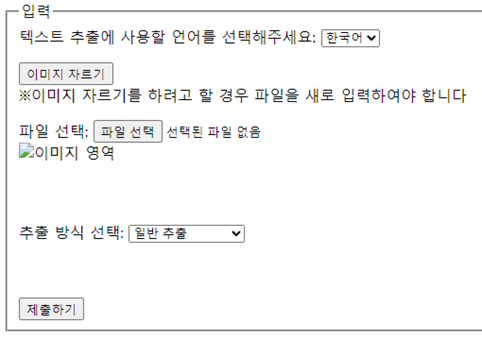

# 사용 가이드

## 목차

- [사용 가이드](#사용-가이드)
  - [목차](#목차)
  - [1. 테스트 페이지 확인](#1-테스트-페이지-확인)
  - [2. 페이지 설명](#2-페이지-설명)
    - [1. 기본 페이지](#1-기본-페이지)
      - [입력](#입력)
      - [스캔 결과](#스캔-결과)
    - [2. 크롭 페이지](#2-크롭-페이지)
      - [크롭 페이지 사용 설명](#크롭-페이지-사용-설명)
    - [3. 요약 페이지](#3-요약-페이지)
    - [4. 태그 페이지](#4-태그-페이지)

## 1. 테스트 페이지 확인

테스트 페이지를 실행 하기 위해서는   
1. eGovFramework 열기
2. Run As > Run on Server로 OCR_summary 프로젝트 실행
   
3. Tomcat v9.0 확인 후 Finish 클릭
   

다음과 같은 화면이 보일 경우 테스트 페이지 불러오기 완료

## 2. 페이지 설명

### 1. 기본 페이지

#### 입력

* **언어 선택** : 프로그램에 사용한 문서가 작성된 언어 선택
  
* **이미지 자르기** : 이미지를 자른 뒤 처리 할 때 클릭
* **파일 선택** : 요약할 문서 이미지나 pdf파일을 입력
* **이미지 영역** : 파일 선택 후 이미지 미리보기
* **추출 방식 선택**
  * **일반 추출** : pdf, 이미지 파일내부의 모든 텍스트를 추출 시도
  * **특정 페이지 추출** : pdf 파일 전용. pdf 파일의 페이지를 지정하여 텍스트 추출 시도
    시작과 종료 페이지 지정 가능
    
* **제출하기** : 텍스트 추출을 위한 파일과 언어를 선택 후 클릭하여 텍스트 추출 (모든 명령은 작업에 시간 소요)
  
#### 스캔 결과

* **스캔한 파일** : 텍스트 추출한 파일의 이름
* **오타수정 요청 전** : 오타 수정을 OpenAI Model에게 요청하기전 Tesseract를 사용 한 이후의 텍스트
* **오타수정 요청 후**
  * **스캔한 파일** : 텍스트 추출한 파일의 이름 (이름 변경 가능)
  * **언어** : 요약 명령에 사용할 언어 (kor 혹은 eng 입력하여 한글 혹은 영어로 언어 지정 가능)
  * **텍스트** : 오타 수정 명령 이후의 텍스트
  * **요약하기** : 수정된 텍스트를 요약하기 위한 버튼. 요약 페이지로 넘어간다
  * **태그 추출하기** : 텍스트에서 태그를 만들어내기 위한 버튼. 태그 페이지로 넘어간다
    
  
### 2. 크롭 페이지

[기본 페이지](#1-기본-페이지)에서 **이미지 자르기 버튼**을 눌러 크롭 페이지로 이동

* **언어 선택** : 한국어와 영어 중 선택
* **파일 선택** : jpg, png등 이미지 파일을 선택(pdf 파일 미지원)
* **파일 이름** : 이미지 크롭(자르기)에 사용된 파일의 이름
* **제출하기** : 이미지를 크롭한 후 제출했을 때 해당 부분에 대한 텍스트 추출 요청
* **뒤로가기** : 이전의 기본 페이지로 이동

#### 크롭 페이지 사용 설명

1. 파일 선택 버튼을 눌러 이미지를 선택한다.
   
2. 자르기 시작하기 버튼을 누른다.
3. 다음과 같이 크롭을 위한 화면이 뜰 경우 원하는 범위를 조절한다
   
4. 이미지 자르기 버튼을 눌러 해당 이미지를 저장한다
5. 제출하기 버튼을 눌러 텍스트 추출을 진행하고 기본 페이지로 자동으로 이동한다
   

### 3. 요약 페이지

[기본 페이지](#1-기본-페이지)에서 요약하기 버튼을 눌러 요약 페이지로 이동

* 파일이름 : 텍스트를 저장할 txt 파일의 이름. 이름 변경 가능
* 요약 결과 : 요약된 텍스트 결과물. 필요에 따라 수정 가능
* 저장 주소 : 파일을 저장할 위치. 사용자가 직접 지정
* 저장하기: 텍스트를 저장하기 위한 버튼. 파일 이름, 요약 텍스트, 저장주소를 토대로 파일을 저장함.   
  파일 이름, 저장주소를 모두 바르게 입력 후 저장하기 버튼을 클릭 시 다음과 같은 메시지가 출력되며 성공적으로 파일 생성   
  
* 뒤로 가기: 기본 페이지로 돌아가기 위한 버튼

### 4. 태그 페이지

[기본 페이지](#1-기본-페이지)에서 태그 추출하기 버튼을 눌러 요약 페이지로 이동

* 언어: 태그 추출을 할 때에 지정된 언어
* 아래의 원본 텍스트의 언어를 주로 따라간다
* 태그: 텍스트로 부터 만들어진 태그 모음집
* 의도 추출하기: 태그를 토대로 본문 텍스트의 의도를 유추하기 위한 버튼
* 의도: 의도 추출하기 버튼을 통해 AI 모델이 유추한 의도 텍스트   
  같은 태그 페이지 형식을 가지지만 의도 추출하기 버튼을 누를 경우 purpose.do라는 주소를 가짐
* WordCloud : Wordcloud가 성공적으로 만들어질 경우 클릭시 Wordcloud를 만드는 웹 사이트를 띄워 준다
* 뒤로가기 : [기본 페이지](#1-기본-페이지)로 돌아간다