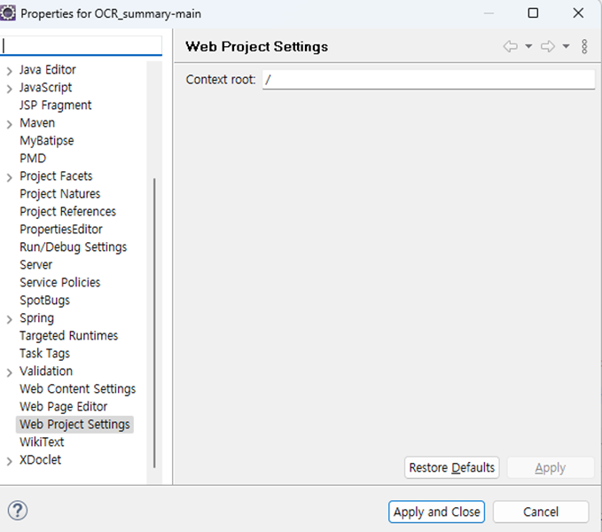

# 설치 가이드

필요 소프트웨어

- [설치 가이드](#설치-가이드)
  - [1. eGovFramework 3.10 설치 및 실행](#1-egovframework-310-설치-및-실행)
    - [Window 환경](#window-환경)
    - [Mac 환경](#mac-환경)
  - [2. Apache Tomcat 9 설치](#2-apache-tomcat-9-설치)
    - [Eclipse에서 Tomcat 서버 설정](#eclipse에서-tomcat-서버-설정)
  - [3. JDK 1.8 설치](#3-jdk-18-설치)
  - [4. OpenAI API 키 발급](#4-openai-api-키-발급)
  - [5. 프로젝트 가져오기](#5-프로젝트-가져오기)
  - [6. Tesseract OCR 5.3.x 설치](#6-tesseract-ocr-53x-설치)
    - [Window 환경](#window-환경-1)
    - [Mac 환경](#mac-환경-1)
  - [7. 프로젝트 실행 확인](#7-프로젝트-실행-확인)
  - [8. 오류 시 해결방법](#8-오류-시-해결방법)
    - [서버 실행 오류](#서버-실행-오류)
    - [Mac Tesseract 라이브러리 탐색 오류](#mac-tesseract-라이브러리-탐색-오류)

## 1. eGovFramework 3.10 설치 및 실행

해당 링크를 통해, 자신의 OS에 알맞게 전자정부프레임워크 3.10을 다운로드 받고 압축을 해제합니다.

[https://www.egovframe.go.kr/home/sub.do?menuNo=41](https://www.egovframe.go.kr/home/sub.do?menuNo=41)


### Window 환경

exe  파일을 실행 후 원하는 위치에 압축 해제 후 eclipse 풀더에서 eclipse 실행


### Mac 환경

용용 프로그램 풀더로 옮긴 후 실행


## 2. Apache Tomcat 9 설치

해당 링크를 통해, 자신의 OS에 알맞게 Apache Tomcat 9 압축 파일을 받고, 원하는 위치에 압축 해제를 합니다.

[https://tomcat.apache.org/download-90.cgi](https://tomcat.apache.org/download-90.cgi)


### Eclipse에서 Tomcat 서버 설정

임의의 프로젝트 생성 또는 OCR_summary 프로젝트를 import

이후 Package Explorer에서 우클릭 -> Run As -> Run on Server


Manually define a new server -> Tomcat v9.0 Server 선택 ->
Server runtime environment가 Apache Tomcat v9.0 확인. 아닐 경우 Add를 눌러, 이전에 압축 해제한 Tomcat 9의 풀더 위치를 지정


## 3. JDK 1.8 설치

해당 링크를 통해, 자신의 OS에 알맞게 JDK 1.8을 다운로드 받고 설치합니다.

[https://www.oracle.com/java/technologies/downloads/#java8](https://www.oracle.com/java/technologies/downloads/#java8)

## 4. OpenAI API 키 발급

해당 링크에 들어가서 OpenAI 로그인

https://platform.openai.com/overview

Menu > API Keys > Create new secret key > 키 값 복사

## 5. 프로젝트 가져오기

해당 링크에서 zip파일을 다운

link

zip파일 압축 해제 후 프로젝트 파일 압축 해제

**eGovFrameDev-3.10.0-64bit\workspace 에 압축해제 하는 것을 추천**

eGovFramework 실행 후 File > Open Projects From File System > Directory를 눌러 해당 폴더 선택


src/main/java/egovframework.ocr.sample.web 폴더에서 KeyValue.java 대신 KeyValue_tmp.java 파일이 존재


KeyValue.java로 파일 이름 수정


해당 코드에서 gptKey 값을 [복사해뒀 던 키값](#4-openai-api-키-발급)으로 수정

## 6. Tesseract OCR 5.3.x 설치

### Window 환경

해당 링크에서 Tesseract OCR 설치 파일을 받고 실행합니다.

[https://github.com/UB-Mannheim/tesseract/wiki](https://github.com/UB-Mannheim/tesseract/wiki)


OK


Next


I Agree


Next


Additional script data -> Hangul script, Hangul vertical script 선택


Additional language data -> Korean 선택


Next


Install


- - -

### Mac 환경

해당 링크에서 Brew를 설치합니다.

https://brew.sh/ko/

다음 명령어를 입력하여 tesseract를 설치합니다.

```Bash
brew install tesseract
brew install tesseract-lang
```

## 7. 프로젝트 실행 확인

프로젝트 우클릭 > Properties > Web Project Settings에서 'ocr'을 '/'으로 변경



프로젝트 우클릭 > Run As > Run on Server


혹은 아래와 같은 절차로 서버를 실행


Configured 항목에 구동하려는 프로그램 OCR-summary-main이 있는 것을 확인하고 없을 경우 Add버튼을 통해 넣음   
이후 Finish 클릭


다음과 같은 테스트 페이지가 확인될 경우 실행 성공


## 8. 오류 시 해결방법

### 서버 실행 오류

다음과 같은 오류가 발생했을 경우


프로젝트 우클릭 > Maven > Update Project


Force Update of Snapshots/Releases 클릭   
OK클릭


Servers 폴더의 Tomcat 9.0 폴더에서 server.xml 열기


맨 아래 Context -> Path의 '/ocr'을 '/'으로 변경


- - -

### Mac Tesseract 라이브러리 탐색 오류

아래와 같은 오류가 발생할 경우 다음 과정을 따른다.

(성준이 데스크탑에 있는 스크린샷)

라이브러리에 tess4j.jar를 추가합니다.

```Bash
cd /User/[유저이름]/.m2/repository/net/sourceforge/tess4j/tess4j/4.5.4
mkdir darwin
jar uf tess4j-4.5.4.jar darwin
cp /usr/local/lib/libtesseract.5.dylib darwin/libtesseract.dylib
jar uf tess4j-4.5.4.jar darwin/libtesseract.dylib
```

다음 명령어를 통해 정상적으로 libtesseract.dylib이 들어갔는지 확인

```Bash
jar tf tess4j-4.5.4.jar
```


Finder에서 보기 방식을 계층 방식으로 바꾼 뒤 shift + cmd + . 를 사용하여 숨김 폴더를 보이게 한다.

Macintosh HD/usr/local/Celler/tesseract/**5.3.4**/share/tessdata/eng.trainddata   
Macintosh HD/usr/local/Celler/tesseract-lang/**4.1.0**/share/tessdata/kor.trainddata

위 2개의 traindata를 Macintosh HD/usr/local/Celler/tesseract에 Copy & Paste 한다.   
***버전은 그 때마다 다를 수도 있다**